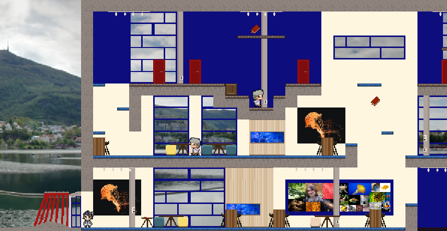

# Operation Exam

Det er eksamensdag og Kurt Mario har forsovet seg! Etter en hektisk dusj og frokost løper Kurt Mario til bybanen for å komme seg til høyteknologisenteret. Når han kommer frem ser han et skilt hvor det står at eksamen er i 6. etasje! Og ikke nok med det, Kurt Mario sovnet halveis inn i skippertaks-økten kvelden før! Hjelp Kurt Mario med å komme seg forbi proffessorene i gangene og nå frem til eksamenslokalet i tide. Plukk opp så mange bøker du klarer på veien for å sørge for at Kurt Mario får en god karakter på eksamen.

## Prosjekt beskrivelse
I dette prosjektet har vi laget et 2D-plattform som har blitt programert i Java. Vi har også benyttet java-biblioteket LibGDX. I spillet kan man styre en spill figur som kan bevege seg venstre/høyre, hoppe, dukke, løpe og gjøre et rask sprang fremover. Det er også lagt inn støtte for lokal-flerspiller modus. Spilleren interagerer med plattformene, fiendene og poeng objektene i spillverdenen. Vi har laget en flott spill-meny for å kunne starte et nytt spill, navigere mellom de ulike levelene, velge en-spiller eller fler-spiller modus, samt endre på innstillinger.

## Bygge, kjøre, teste

Prosjektet kan enkelt bygges, testes, og kjøres gjennom en IDE som IntelliJ IDEA eller Eclipse, så lenge maven er installert.
Maven brukes da av editorene til å installere `LibGDX`, som er den eneste dependencien til prosjektet. Her er linker til å laste ned [InelliJ](https://www.jetbrains.com/idea/download/#section=linux) og [Eclipse](https://www.eclipse.org/downloads/).
Etter du har lastet ned enten IntelliJ eller Eclipse, kan du [importere prosjekt fra gitlab til IntelliJ](https://www.jetbrains.com/help/idea/set-up-a-git-repository.html#clone-repo) eller [importere det i Eclipse](https://www.theserverside.com/blog/Coffee-Talk-Java-News-Stories-and-Opinions/How-to-import-a-Maven-project-from-GitHub-into-Eclipse). (GitLab fungerer likt som GitHub så du kan bruke linkene selv om de har tatt utgangspunkt i GitHub). 
Når du har har klart å åpne prosjektet i IDE'en kan du navigere deg frem til Main klassen (src > main > java > core > Main) og derertter høyre-klikke på den og velge run i IntelliJ elles run as Java Application. 
For å kjøre testene må du høyre-klikke på src/test/java mappen og velge Run all tests i IntelliJ og run as JUnit test i Eclipse.

Man kan også bruke maven manuelt til å kunne kjøre og bygge programmet. For å installere dependencies kan man kjøre
`mvn install`, og for å bygge programmet kan man kjøre `mvn package`. Package funksjonen vil gi oss en `.jar` fil som kan kjøres, dersom `javac` peker til rett java versjon (17).
For at denne `.jar` filen skal kunne kjøres må man kopiere `assets` mappen inn i `targets` mappen, da den leter etter disse filene i mappen den er i

### Screenshots
  
  
  
  
  
