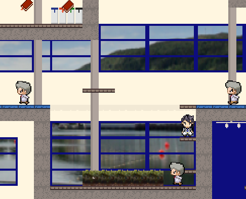

# Operation Exam

Det er eksamensdag og Kurt Mario har forsovet seg! Etter en hektisk dusj og frokost løper Kurt Mario til bybanen for å komme seg til høyteknologisenteret. Når han kommer frem ser han et skilt hvor det står at eksamen er i 8. etasje! Og ikke nok med det, Kurt Mario sovnet halveis inn i skippertaks-økten kvelden før! Hjelp Kurt Mario med å komme seg forbi proffessorene i gangene og nå frem til eksamenslokalet i tide. Plukk opp så mange bøker du klarer på veien for å sørge for at Kurt Mario får en god karakter på eksamen.

## Prosjekt beskrivelse
I dette prosjektet har vi laget et 2D-plattform som har blitt programert i Java. Vi har også benyttet java-biblioteket LibGDX. I spillet kan man styre en spill figur som kan bevege seg venstre/høyre, hoppe, dukke, løpe og gjøre et rask sprang fremover. Det er også lagt inn støtte for lokal-flerspiller modus. Spilleren interagerer med plattformene, fiendene og poeng objektene i spillverdenen. Vi har laget en flott spill-meny for å kunne starte et nytt spill, navigere mellom de ulike levelene, velge en-spiller eller fler-spiller modus, samt endre på innstillinger.

## Bygge, kjøre, teste

Prosjektet kan enkelt bygges, testes, og kjøres gjennom en IDE som IntelliJ IDEA eller Eclipse, så lenge maven er installert.
Maven brukes da av editorene til å installere `LibGDX`, som er den eneste dependencien til prosjektet. Her er linker til å laste ned [InelliJ](https://www.jetbrains.com/idea/download/#section=linux) og [Eclipse](https://www.eclipse.org/downloads/).
Etter du har lastet ned enten IntelliJ eller Eclipse, kan du [importere prosjekt fra gitlab til IntelliJ](https://www.jetbrains.com/help/idea/set-up-a-git-repository.html#clone-repo) eller [importere det i Eclipse](https://www.theserverside.com/blog/Coffee-Talk-Java-News-Stories-and-Opinions/How-to-import-a-Maven-project-from-GitHub-into-Eclipse). (GitLab fungerer likt som GitHub så du kan bruke linkene selv om de har tatt utgangspunkt i GitHub). 
Når du har har klart å åpne prosjektet i IDE'en kan du navigere deg frem til Main klassen (src > main > java > core > Main) og derertter høyre-klikke på den og velge run i IntelliJ elles run as Java Application. 
For å kjøre testene må du høyre-klikke på src/test/java mappen og velge Run all tests i IntelliJ og run as JUnit test i Eclipse.  
For å bygge en `.jar` fil som kan kjøres hvor som helst uten å trenge resten av prosjektet så kan man i IntelliJ åpne maven sidepanelet og trykke på `execute maven goals` og så kjøre `maven clean` og så `maven package`. 
I den nye mappen `target` som da kommer opp vil det ligge en `Operation-Exam-<version>-SNAPSHOT-fat.jar` fil som kan kjøres uavhengig av koden.

Man kan også bruke maven manuelt til å kunne kjøre og bygge programmet. Da trenger man `git`, `java` og `maven` installert på datamaskinen. 
Man kjører da `git clone https://git.app.uib.no/biosoft-productions/Operation-Exam.git` i terminalen og flytter seg inn i prosjektmappen med `cd Operation-Exam`.
For å installere dependencies kan man kjøre
`mvn install`, og for å bygge programmet kan man kjøre `mvn clean` og så `mvn package`. Package funksjonen vil gi oss en `.jar` fil som kan kjøres, dersom `javac` peker til rett java versjon (17).
Dette vil gi oss samme fil som over, `Operation-Exam-<versjon>-SNAPSHOT-fat.jar` som ligger i `target` mappen.  

`-fat.jar` filen kan kjøres fra en hvilken som helst datamaskin med Java 17 på.
Det gjøres enkelt ved å kalle `java -jar Operation-Exam-<versjon>-fat.jar`.

### Screenshots

  
  
  

## English Description

It's exam day and Kurt Mario has fallen asleep! After a hectic shower and breakfast, Kurt Mario runs to the light rail to get to the high-tech center. When he arrives, he sees a sign that says the exam is on the 8th floor! And not only that, Kurt Mario fell asleep halfway into the skipper's session the night before! Help Kurt Mario get past the professors in the hallways and reach the exam room on time. Pick up as many books as you can on the way to make sure Kurt Mario gets a good grade on the exam.

## Project description
In this project we have created a 2D platform that has been programmed in Java. We have also used the java library LibGDX. In the game you can control a game character that can move left / right, jump, duck, run and make a quick leap forward. Support for local multiplayer mode has also been added. The player interacts with the platforms, enemies and points objects in the game world. We have created a great game menu to be able to start a new game, navigate between the different levels, choose single-player or multi-player mode, and change settings.

## Build, run, test

The project can be easily built, tested, and run through an IDE such as IntelliJ IDEA or Eclipse, as long as the stomach is installed.
Maven is then used by the editors to install `LibGDX`, which is the only dependency of the project. Here are links to download [InelliJ] (https://www.jetbrains.com/idea/download/#section=linux) and [Eclipse] (https://www.eclipse.org/downloads/).
After downloading either IntelliJ or Eclipse, you can [import project from gitlab to IntelliJ] (https://www.jetbrains.com/help/idea/set-up-a-git-repository.html#clone-repo ) or [import it into Eclipse] (https://www.theserverside.com/blog/Coffee-Talk-Java-News-Stories-and-Opinions/How-to-import-a-Maven-project-from-GitHub -into-Eclipse). (GitLab works the same as GitHub so you can use the links even if they are based on GitHub).
Once you have managed to open the project in the IDE, you can navigate to the Main class (src> main> java> core> Main) and then right-click on it and select run in IntelliJ otherwise run as Java Application.
To run the tests, right-click on the src / test / java folder and select Run all tests in IntelliJ and run as JUnit test in Eclipse.
To build a `.jar` file that can be run anywhere without needing the rest of the project, you can in IntelliJ open the maven side panel and press` execute maven goals` and then run `maven clean` and then` maven package` .
In the new folder `target` that will appear, there will be an` Operation-Exam- <version> -SNAPSHOT-fat.jar` file that can be run independently of the code.

You can also use your stomach manually to run and build the program. Then you need `git`,` java` and `maven` installed on the computer.
You then run `git clone https: // git.app.uib.no / biosoft-productions / Operation-Exam.git` in the terminal and move into the project folder with` cd Operation-Exam`.
To install dependencies you can run
`mvn install`, and to build the program you can run` mvn clean` and then `mvn package`. The package function will give us a `.jar` file that can be run, if` javac` points to the correct java version (17).
This will give us the same file as above, `Operation-Exam- <Version> -SNAPSHOT-fat.jar` which is located in the` target` folder.

The `-fat.jar` file can be run from any computer running Java 17.
This is easily done by calling `java -jar Operation-Exam- <version> -fat.jar`.
